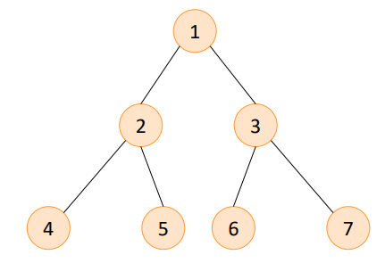

# Golang


---------------------------------------------------------------------

# Binary Search Trees

* Stacks, queues, arrays, slices are linear data structures.
* Linear data structures have the notions of **next** and **previous**.
* Trees are non-linear data structures in which data are stored in a **hierarchical relationship**.

* Tree T is a set of nodes storing elements such that nodes have a parent-child relationship.
* If tree is not empty, it has a node without a parent, which is called root.
* There are more concepts like subtrees, siblings, leaf nodes, edges an paths. If you want, you can search for more information.

--------------------------------------------------------------------
## Binary Search Trees

Binary tree is an ordered tree s.t.:
* Each node has at most two children
* Each node is labeled as left/right child
* Left child precedes the right child in the children order.



-------------------------------------------------------------------
### ADT operations

Since trees are very complicated data structures, there are many ADT operationsof them. Some of them and their computational complxities can be seen below.

| **Operation** | **Complexity** |
| ------------- | -------------- |
| T.Insert(v)   | O(h)           |
| T.Delete(v)   | O(h)           |
| T.Search(v)   | O(h)           |
| T.First()     | O(h)           |
| T.Last()      | O(h)           |

In this implementation, we will consider two of them which are **Insert** and **Search**.
--------------------------------------------------------
### Code Implementatiton

* For code implementation, simple struct elements are created as nodes. 
* Furthermore, they link each other in terms of parent-child relationship.
----------------------------------------------------------------
### Code usage
```go
tree := &Node{Value: 100}
fmt.Println(*tree)
tree.Insert(200)
fmt.Println(*tree)
tree.Insert(22)
tree.Insert(55)
tree.Insert(11)
tree.Insert(33)
tree.Insert(66)
tree.Insert(112)
tree.Insert(222)
fmt.Println("66", tree.Search(66))
fmt.Println("112", tree.Search(112))
fmt.Println("99", tree.Search(99))
fmt.Println("300", tree.Search(300))
```
```[console]
{100 <nil> <nil>}
{100 <nil> 0xc000096078}
66 true
112 true
99 false
300 false
```
* In this implementation, only the root struct can be seen. However, it can be implemented to show all values of nodes via slice or array.
--------------------------------------------------------
### License
MIT
